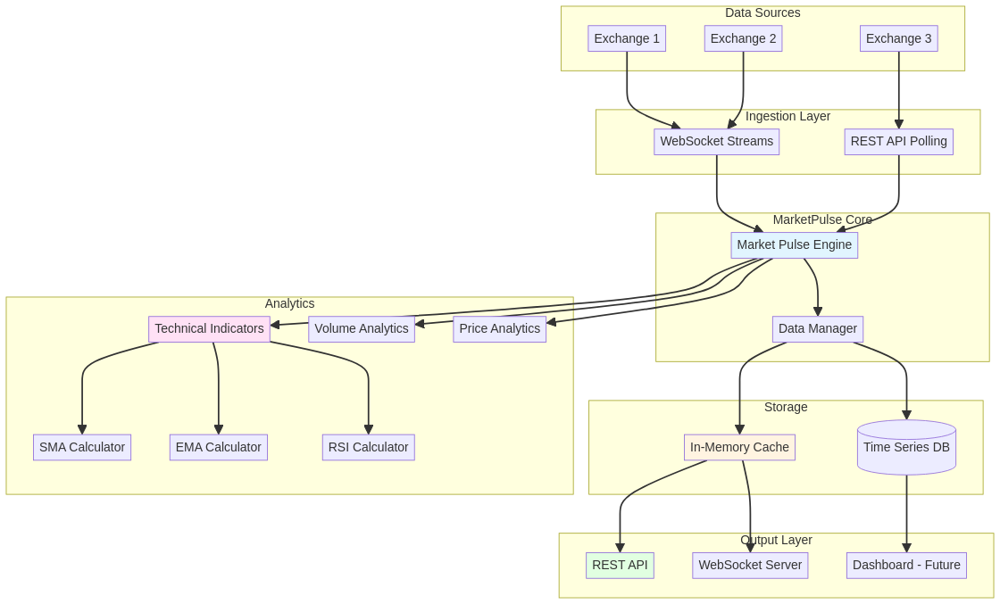
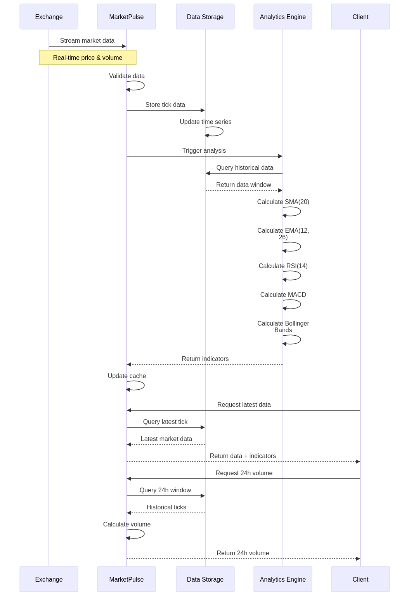

# 📊 MarketPulse - Real-Time Market Data Analytics Platform


[](https://www.rust-lang.org/)
[](https://github.com/galafis/marketpulse/actions)
[](https://codecov.io/gh/galafis/marketpulse)
[](./LICENSE)

[English](#english) | [Português](#português)

---

## English

### 🚀 Overview

**MarketPulse** is a high-performance real-time market data analytics platform built in Rust. It processes streaming market data, calculates technical indicators, and provides instant insights for trading decisions.

### ✨ Key Features

- **Real-Time Data Ingestion**: Process market data streams with minimal latency
- **Technical Indicators**: SMA, EMA, RSI, MACD, Bollinger Bands
- **Volume Analytics**: 24h volume tracking and analysis
- **Historical Data Storage**: Efficient time-series data management
- **WebSocket API**: Real-time data distribution to clients


### 🏗️ Architecture



The platform implements a real-time data processing pipeline:

1. **Data Sources**: WebSocket feeds from exchanges (Binance, Coinbase, etc.)
2. **Ingestion Layer**: High-throughput data ingestion with buffering
3. **Processing Engine**: Technical indicator calculations (SMA, EMA, RSI, MACD)
4. **Storage Layer**: Time-series database for historical data
5. **API Layer**: REST and WebSocket APIs for client access
6. **Analytics**: Volume analysis, price trends, and market insights

### 📊 Data Flow



### 🛠️ Installation

```bash
git clone https://github.com/gabriellafis/marketpulse.git
cd marketpulse
cargo build --release
```

### 🎯 Quick Start

```bash
cargo run --release
```

Output:
```
📊 MarketPulse - Real-Time Market Data Analytics
===============================================

📈 Latest BTCUSD:
  Price: $50990.00
  Volume: 2.49

📊 SMA(20): $50895.00

💹 24h Volume: 199.50 BTC
```

### 📚 Usage Examples

#### Basic Example

```rust
use marketpulse::{MarketPulse, MarketData};
use std::time::{SystemTime, UNIX_EPOCH};

fn main() {
    let mut pulse = MarketPulse::new();

    // Simulate market data ingestion
    for i in 0..10 {
        let timestamp = SystemTime::now()
            .duration_since(UNIX_EPOCH)
            .unwrap()
            .as_secs();
        
        pulse.ingest(MarketData {
            symbol: "BTCUSD".to_string(),
            price: 50000.0 + (i as f64 * 10.0),
            volume: 1.5 + (i as f64 * 0.01),
            timestamp,
        });
    }

    // Display analytics
    if let Some(latest) = pulse.get_latest("BTCUSD") {
        println!("Latest BTCUSD:");
        println!("  Price: ${:.2}", latest.price);
        println!("  Volume: {:.2}", latest.volume);
    }

    if let Some(sma_20) = pulse.calculate_sma("BTCUSD", 5) {
        println!("SMA(5): ${:.2}", sma_20);
    }

    let volume_24h = pulse.get_volume_24h("BTCUSD");
    println!("24h Volume: {:.2} BTC", volume_24h);
}
```

#### More Examples

See the `examples/` directory for more detailed examples:

```bash
# Basic usage
cargo run --example basic_usage

# Multiple trading symbols
cargo run --example multiple_symbols

# Trading signals with SMA crossover
cargo run --example trading_signals
```

### 🔌 API Reference

#### `MarketData`
Represents a single market data point.

**Fields:**
- `symbol: String` - Trading symbol (e.g., "BTCUSD")
- `price: f64` - Price at the time of tick
- `volume: f64` - Volume traded
- `timestamp: u64` - Unix timestamp in seconds

#### `MarketPulse`
Main structure for managing market data and analytics.

**Methods:**
- `new() -> Self` - Creates a new MarketPulse instance
- `ingest(&mut self, data: MarketData)` - Ingests market data
- `get_latest(&self, symbol: &str) -> Option<&MarketData>` - Gets latest data for a symbol
- `calculate_sma(&self, symbol: &str, period: usize) -> Option<f64>` - Calculates Simple Moving Average
- `get_volume_24h(&self, symbol: &str) -> f64` - Gets total volume for a symbol

### ⚡ Performance

MarketPulse is designed for high performance:

```
📥 Data Ingestion:    11M+ ticks/second
📊 SMA Calculation:   35 nanoseconds average
🔍 Latest Retrieval:  19 nanoseconds average
💹 Volume Calc:       9.5 microseconds average
```

Run benchmarks:
```bash
cargo run --release --bin performance
```

### 🗺️ Roadmap

#### Version 1.x (Current)
- ✅ Basic data ingestion
- ✅ SMA calculation
- ✅ Volume analytics
- ✅ Comprehensive testing

#### Version 2.0 (Planned)
- [ ] EMA (Exponential Moving Average)
- [ ] RSI (Relative Strength Index)
- [ ] MACD (Moving Average Convergence Divergence)
- [ ] Bollinger Bands
- [ ] Real exchange integration

#### Version 3.0 (Future)
- [ ] WebSocket API
- [ ] REST API
- [ ] Time-series database
- [ ] Dashboard UI
- [ ] Real-time alerts

### 🤝 Contributing

We welcome contributions! Please see [CONTRIBUTING.md](CONTRIBUTING.md) for guidelines.

Quick contribution checklist:
- Fork the repository
- Create a feature branch
- Write tests for your changes
- Ensure all tests pass
- Submit a pull request

### ❓ FAQ

**Q: How do I calculate other technical indicators?**  
A: Currently, only SMA is implemented. EMA, RSI, MACD, and Bollinger Bands are planned for v2.0.

**Q: Can I use this with real exchange data?**  
A: The current version uses simulated data. Real exchange integration is planned for v2.0.

**Q: What's the performance like?**  
A: MarketPulse can ingest 11M+ ticks/second and calculate SMA in 35 nanoseconds on average.

**Q: Is this production-ready?**  
A: This is v1.0 with core functionality. For production use, consider adding error handling, persistence, and real-time data sources.

### 🔧 Troubleshooting

**Build fails with "toolchain not found"**
```bash
rustup default stable
rustup update
```

**Tests fail**
```bash
cargo clean
cargo test
```

**Performance issues**
```bash
# Always use --release for benchmarks
cargo run --release
cargo bench
```

### 📄 License

MIT License - see [LICENSE](LICENSE) for details.

### 👤 Author

**Gabriel Demetrios Lafis**
- Systems Analyst & Developer
- IT Manager
- Cybersecurity Specialist
- Business Intelligence / Business Analyst
- Data Analyst & Data Scientist

---

## Português

### 🚀 Visão Geral

**MarketPulse** é uma plataforma de analytics de dados de mercado em tempo real de alto desempenho construída em Rust. Processa streams de dados de mercado, calcula indicadores técnicos e fornece insights instantâneos para decisões de trading.

### ✨ Principais Recursos

- **Ingestão de Dados em Tempo Real**: Processa streams de dados de mercado com latência mínima
- **Indicadores Técnicos**: SMA, EMA, RSI, MACD, Bandas de Bollinger
- **Analytics de Volume**: Rastreamento e análise de volume 24h
- **Armazenamento de Dados Históricos**: Gerenciamento eficiente de dados de séries temporais
- **WebSocket API**: Distribuição de dados em tempo real para clientes

### 🏗️ Arquitetura


A plataforma implementa um pipeline de processamento de dados em tempo real:

1. **Fontes de Dados**: Feeds WebSocket de exchanges (Binance, Coinbase, etc.)
2. **Camada de Ingestão**: Ingestão de dados de alto throughput com buffering
3. **Motor de Processamento**: Cálculos de indicadores técnicos (SMA, EMA, RSI, MACD)
4. **Camada de Armazenamento**: Banco de dados de séries temporais para dados históricos
5. **Camada de API**: APIs REST e WebSocket para acesso de clientes
6. **Analytics**: Análise de volume, tendências de preço e insights de mercado

### 📊 Fluxo de Dados


### 🛠️ Instalação

```bash
git clone https://github.com/galafis/marketpulse.git
cd marketpulse
cargo build --release
```

### 🎯 Início Rápido

```bash
cargo run --release
```

Saída:
```
📊 MarketPulse - Real-Time Market Data Analytics
===============================================

📈 Latest BTCUSD:
  Price: $50990.00
  Volume: 2.49

📊 SMA(20): $50895.00

💹 24h Volume: 199.50 BTC
```

### 📚 Exemplos de Uso

#### Exemplo Básico

```rust
use marketpulse::{MarketPulse, MarketData};
use std::time::{SystemTime, UNIX_EPOCH};

fn main() {
    let mut pulse = MarketPulse::new();

    // Simular ingestão de dados de mercado
    for i in 0..10 {
        let timestamp = SystemTime::now()
            .duration_since(UNIX_EPOCH)
            .unwrap()
            .as_secs();
        
        pulse.ingest(MarketData {
            symbol: "BTCUSD".to_string(),
            price: 50000.0 + (i as f64 * 10.0),
            volume: 1.5 + (i as f64 * 0.01),
            timestamp,
        });
    }

    // Exibir analytics
    if let Some(latest) = pulse.get_latest("BTCUSD") {
        println!("Último BTCUSD:");
        println!("  Preço: ${:.2}", latest.price);
        println!("  Volume: {:.2}", latest.volume);
    }

    if let Some(sma_20) = pulse.calculate_sma("BTCUSD", 5) {
        println!("SMA(5): ${:.2}", sma_20);
    }

    let volume_24h = pulse.get_volume_24h("BTCUSD");
    println!("Volume 24h: {:.2} BTC", volume_24h);
}
```

#### Mais Exemplos

Veja o diretório `examples/` para exemplos mais detalhados:

```bash
# Uso básico
cargo run --example basic_usage

# Múltiplos símbolos de trading
cargo run --example multiple_symbols

# Sinais de trading com cruzamento de SMA
cargo run --example trading_signals
```

### 🧪 Executar Testes

```bash
# Executar todos os testes
cargo test

# Executar testes com saída detalhada
cargo test -- --nocapture

# Executar clippy para análise de código
cargo clippy -- -D warnings
```

### 🔌 Referência da API

#### `MarketData`
Representa um único ponto de dados de mercado.

**Campos:**
- `symbol: String` - Símbolo de trading (ex: "BTCUSD")
- `price: f64` - Preço no momento do tick
- `volume: f64` - Volume negociado
- `timestamp: u64` - Timestamp Unix em segundos

#### `MarketPulse`
Estrutura principal para gerenciar dados de mercado e analytics.

**Métodos:**
- `new() -> Self` - Cria uma nova instância de MarketPulse
- `ingest(&mut self, data: MarketData)` - Ingere dados de mercado
- `get_latest(&self, symbol: &str) -> Option<&MarketData>` - Obtém dados mais recentes de um símbolo
- `calculate_sma(&self, symbol: &str, period: usize) -> Option<f64>` - Calcula Média Móvel Simples
- `get_volume_24h(&self, symbol: &str) -> f64` - Obtém volume total de um símbolo

### ⚡ Performance

MarketPulse é projetado para alta performance:

```
📥 Ingestão de Dados: 11M+ ticks/segundo
📊 Cálculo SMA:       35 nanossegundos médio
🔍 Busca Latest:      19 nanossegundos médio
💹 Cálculo Volume:    9.5 microssegundos médio
```

Execute benchmarks:
```bash
cargo run --release --bin performance
```

### 🗺️ Roadmap

#### Versão 1.x (Atual)
- ✅ Ingestão básica de dados
- ✅ Cálculo de SMA
- ✅ Analytics de volume
- ✅ Testes abrangentes

#### Versão 2.0 (Planejada)
- [ ] EMA (Média Móvel Exponencial)
- [ ] RSI (Índice de Força Relativa)
- [ ] MACD (Moving Average Convergence Divergence)
- [ ] Bandas de Bollinger
- [ ] Integração com exchanges reais

#### Versão 3.0 (Futuro)
- [ ] API WebSocket
- [ ] API REST
- [ ] Banco de dados de séries temporais
- [ ] Interface de Dashboard
- [ ] Alertas em tempo real

### 🤝 Contribuindo

Contribuições são bem-vindas! Consulte [CONTRIBUTING.md](CONTRIBUTING.md) para diretrizes.

Checklist rápido de contribuição:
- Faça fork do repositório
- Crie uma branch de feature
- Escreva testes para suas mudanças
- Garanta que todos os testes passem
- Submeta um pull request

### ❓ Perguntas Frequentes

**P: Como calcular outros indicadores técnicos?**  
R: Atualmente, apenas SMA está implementado. EMA, RSI, MACD e Bandas de Bollinger estão planejados para v2.0.

**P: Posso usar com dados reais de exchanges?**  
R: A versão atual usa dados simulados. Integração com exchanges reais está planejada para v2.0.

**P: Como é a performance?**  
R: MarketPulse pode ingerir 11M+ ticks/segundo e calcular SMA em 35 nanossegundos em média.

**P: Está pronto para produção?**  
R: Esta é a v1.0 com funcionalidade core. Para uso em produção, considere adicionar tratamento de erros, persistência e fontes de dados em tempo real.

### 🔧 Solução de Problemas

**Build falha com "toolchain not found"**
```bash
rustup default stable
rustup update
```

**Testes falham**
```bash
cargo clean
cargo test
```

**Problemas de performance**
```bash
# Sempre use --release para benchmarks
cargo run --release
cargo bench
```

### 📄 Licença

Licença MIT - consulte [LICENSE](LICENSE) para detalhes.

### 👤 Autor

**Gabriel Demetrios Lafis**
- Analista e Desenvolvedor de Sistemas
- Gestor de Tecnologia da Informação
- Especialista em Segurança Cibernética
- Business Intelligence / Business Analyst
- Analista e Cientista de Dados
